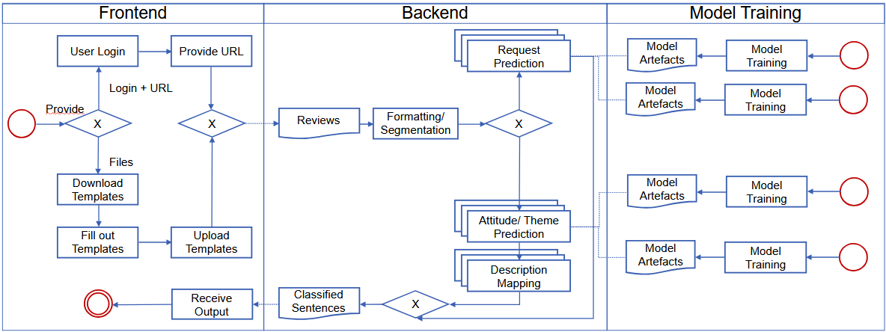

  
  

# **Review Overview Generation**

## **1.Project Overview**

At **Paper Review Aggregator**, our mission is to simplify the work of meta-reviewers by providing an AI-driven platform that aggregates and summarizes paper reviews. By reducing manual effort and enhancing decision-making, we aim to streamline the peer-review process for academic research.
This application was developed as part of the **"Data Analysis Software Project"** course at **Technische Universität Darmstadt, Germany**. The project allowed Master’s students to apply their data analysis, software engineering, and machine learning skills to solve real-world problems.

---
### **2. Installation and Setup Instructions**

This guide helps you set up and run the project, which consists of three main parts:
- **Model Training (NLP models environment)**
- **Backend (APIs connecting frontend and models )**
- **Frontend (UI environment via streamlit)**

---

**Prerequisites**

- **Git** for cloning the repository.
- **Python 3.12.7+** installed on your system.
- **conda**  for managing Python environments.

---
1. **Clone the Repository** :
   git clone https://github.com/sukannyapurkayastha/DASP_report_template.git
   cd your-project

2. **Set Up the Model Environment**:
  conda env create -f model_env.yaml
  conda activate your-model-env
  conda env create -f backend_env.yaml
  conda activate your-backend-env
  conda env create -f frontend_env.yaml
  conda activate your-frontend-env

3. **Start the application**
  Run the application with:
  streamlit app.py

Architecture and Design Notes
##### **3. Architecture and Design Notes**
##### **3.1 Architecture**

##### **3.2 Design Notes**

##### **3.2.1 Frontend**
The Frontend is the user interface of the system where individuals log in, provide a URL to OpenReview, and optionally download and then upload the filled out templates. The Frontend handles interactions, collects the user’s input (including files and URLs), and displays the resulting classification output once the Backend has processed everything.

##### **3.2.2 Backend**
Once the Frontend submits data (whether uploaded files or URLs), the Backend starts analyzing the provided data. It first performs formatting and segmentation, breaking the reviews into sentences. From there, the system routes the segments to various prediction modules. The “Request Prediction” module handles general categorization of the Request, while an “Attitude/Theme Prediction” module determines attitude and corresponding themes and descriptions. After processing these steps, the Backend compiles the outputs—now in the form of classified sentences or structured results—and sends them back to the Frontend to display to the user.

##### **3.2.3 Model Training**
As part of our framework, there is the model training. Initially we trained the models used in the Backend to perform the neccesary classification tasks. This training process results in Model Artifacts, such as updated model parameters, which the Backend uses during its prediction steps. If necessary, the existing model and code files can be used to update and improve existing models with new data or better models.

##### **3.2.3 Communication Flow**
    Frontend → Backend

    The Frontend issues secure API calls to the Backend when users log in, provide URLs, or upload filled templates.
    The Backend processes these incoming requests—formatting and segmenting the data—and routes them to the appropriate prediction modules.

  Backend → Frontend

    Once the predictions are complete, the Backend responds via API calls back to the Frontend, delivering classified sentences, sentiment results, or other structured outputs.
    The Frontend then displays these results to the user in a clear, readable format.
    
  Model Training and Backend:

    The models trained in the Backend are stored in the designated containers with are activated when the Backend is called.

##### **4. Detailed description of the files**

##### **4.1 `backend`**

The backend is responsible for data collection from OpenReview, preprocessing the data, and managing the workflow between the models and the frontend. It sends preprocessed data to the models for processing, retrieves the results, and communicates the processed data to the frontend for further use.

- **Subdirectories**:
  - `dataloading`: includes scripts for using the open review API
  - `models`: includes the models which are used to predict the NLP component of this application
  - `nlp`: ...
  - `text_processing`: includes file and scripts which are used to preprocess and prepare review for the models

- **Files**:
  - `__init__.py`: ...
  - `backend_env.yaml`: includes specific enviroment for the backend functionality
  - `data_processing.py`: calls functions from text processing  
  - `main.py`: creates FastAPI app and runs it
  - `routers.py`: defines a FastAPI endpoint and structures processed data into dictonaries

---

##### **4.2 `frontend`**

Thies front end of this application is the user-facing interface built with Streamlit and related UI components. It is responsible for displaying the overview over the given reviews, receive the data in form of URL or file, and providing an interactive experience within the application. It is connected via API calls to the backend and includes several features of displaying the data for the user.

- **Subdirectories**:
  - `images`: includes the images needed for displaying the front end 
  - `data`: includes the templates for the user if data of reviews is manually input 
  - `modules`: includes several scriptsfor features of the frontend like containers for specific parts of the data or elements 
              of the website like the side bar
  - `clients`: includes the client for excessing OpenReview
  - `.streamlit`: includes a configfile for the custom design

- **Files**:
  - `__init__.py`: Initializes the Python package and sets up the module structure (not in use)
  - `about.py`: calls about under modules which contains content and layout logic for the "About" page of the front end
  - `app.py`: Coordinates the overall structure and routing of the front end application’s pages
  - `contact.py`: calls about under modules which  implements the "Contact" page, providing forms or information for user inquiries
  - `data.ipynb`: jupyper notebook with specifies the right structure and content of the dataframes for the front end 
  - `frontend_env.yaml`: Defines the environment dependencies and configurations for running the front end
  - `home_page.py`: Implements the "Home" page, showcasing primary content and user entry points
  - `landing_page.py`: Sets up the initial landing view, guiding users to the main sections of the application
  - `main_page.py`: Acts as the core page aggregating or linking to the main functionalities of the site
  - `README`: A documentation file describing the purpose, setup, and usage of the front end
  - `run.py`: A script that launches the Streamlit application and makes the front end accessible
  - `streamlit_app.py`: The primary Streamlit script coordinating UI components, page navigation, and interactions

---

##### **4.3 `model_training`**

The model training folder includes the scripts and data which which the models where trained.

- **Subdirectories**:
  - `attitude_classifier`: includes the scripts for fine tuning the a model for multi class classification for attitude roots
  - `e2e_review_to_desc`:  includes the scripts and the data for fine tuning the a model for multi class classification for#
                           attitude themes and matches them to a description 
  - `request_classifier`: includes the data (DISAPERE) and the scripts for binary classication for Review_Action Request vs. All 
                          and a multi class classification for the fine review actions 
  - `review_to_theme`: includes scripts for mapping review sentences to themes
---

###### **5 `Contact`**

If you have any questions or suggestions regarding this project, feel free to reach out:

- **Your Name**: [Max Mustermann]
- **Email**: [your.email@example.com]
- **GitHub Profile**: [Max Mustermann](https://github.com/YourUsername)

Thank you for your interest in this project!

####### **6 `Contributions`**

in this project participated ... and our supervisor ....