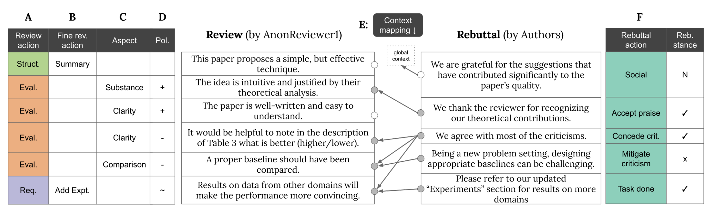
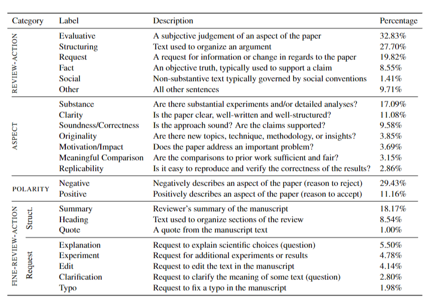
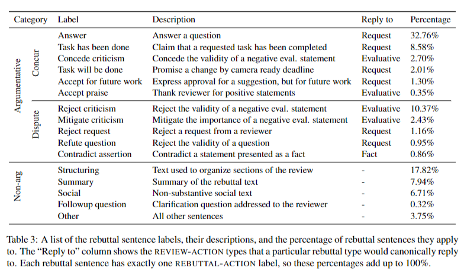
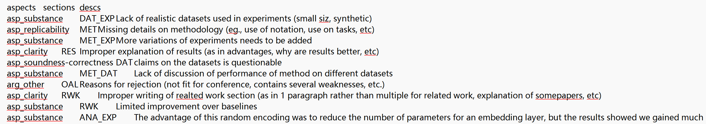
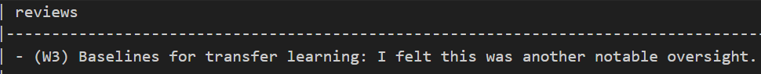
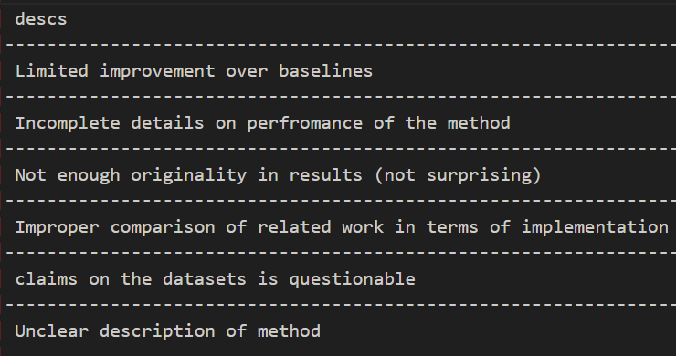
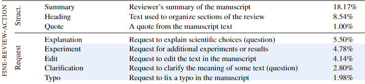

# Softwareprojekt Datenanalyse für natürliche Sprache

CP: 6
Status: In progress
category: Studienleistung


# DISAPERE

DISAPERE is the start point of JITSUPEER.

Purposes: rebuttal behavior analysis

## Labels Overview

ABCDEF are labels, F contaiins 2 levels



## Data Source

review-rebuttal pairs from the International Conference on Learning Representations (ICLR) in 2019 and 2020

## Review Labels

- **Review Actions**
    - The researchers identified six main types of sentences in reviews. Each type serves a different purpose. Here’s a breakdown of these types:
    1. **Evaluative Sentences:**
        - These sentences express opinions or judgments about the work being reviewed. For example, a reviewer might say, "The methodology used in this study is robust." This sentence evaluates the quality of the methodology.
    2. **Fact Sentences:**
        - Fact sentences provide information or state facts without giving an opinion. For instance, "The study was conducted over a period of six months." This sentence simply presents a fact about the study.
    3. **Request Sentences:**
        - These sentences ask for more information or clarification. They can include questions. For example, "Can you explain how you collected your data?" This is a request for more details.
    4. **Social Sentences:**
        - Social sentences are used to create a friendly or polite tone in the review. They might include greetings or expressions of appreciation. For example, "Thank you for your hard work on this paper." This helps build a positive relationship between the reviewer and the author.
    5. **Structuring Sentences:**
        - These sentences help organize the review. They guide the reader through the text. For example, "First, I will discuss the strengths of the paper." This sentence sets up the structure for what the reviewer will talk about next.
    6. **Non-Argument Types:**
        - This category includes sentences that do not directly argue for or against something. They might serve other purposes, like providing context or background information.
- **ASPECT and POLARITY**
    - **What is ASPECT?**
        - ASPECT refers to different qualities or features that reviewers look for when they evaluate a piece of work. Think of it like a checklist that helps reviewers focus on important areas. The ASPECTs mentioned in the text include:
            - **Clarity**: This means how clear and easy to understand the writing is. If a paper is full of complicated words and ideas, it might not be clear to readers.
            - **Originality**: This checks if the work presents new ideas or approaches. Original work is like a fresh recipe that no one has tried before.
            - **Soundness/Correctness**: This aspect looks at whether the arguments and conclusions in the paper are logical and correct. It’s like checking if a math problem has the right answer.
            - **Replicability**: This means whether other researchers can repeat the study and get the same results. If a recipe works for one chef, it should work for others too.
            - **Substance**: This refers to the depth and richness of the content. A paper with substance has a lot of valuable information and insights.
            - **Impact/Motivation**: This aspect evaluates how important the work is and what motivates the research. It’s like asking if the recipe is not only tasty but also good for health.
            - **Meaningful Comparison**: This checks if the paper compares its findings with other studies in a useful way. It’s like comparing different recipes to see which one is better.
    - **What is POLARITY?**
        - POLARITY is about labeling the ASPECTs as either positive or negative. This helps reviewers express their opinions clearly. For example:
            - If a paper is very clear, it might get a **positive** label for clarity.
            - If the originality is lacking, it might receive a **negative** label for originality.
    



- review_sentences
    - {
    "review_id": "B1gLu2Q1iS",
    "sentence_index": 7,
    "text": "1. Why the color distribution of generated images is evaluated on a sampled subset of pixels, not full images?",
    "suffix": "",
    "review_action": "arg_request",
    "fine_review_action": "arg-request_explanation",
    "aspect": "asp_clarity",
    "polarity": "none"
    },

## Rebuttal Labels



### Rebuttal context labels

The "global context" means looking at the review as a whole, while "empty set" means there is no specific context to refer to. This helps in understanding whether the comments are about the entire review or just a small part.

- rebuttal_sentences
    - {
    "review_id": "B1gLu2Q1iS", 
    "rebuttal_id": "HyxKK7PvsS",
    "sentence_index": 0,
    "text": "Thank you for your comments and questions; we have incorporated these in the revision and respond to your questions below.",
    "suffix": "\n\n",
    "rebuttal_stance": "nonarg",
    "rebuttal_action": "rebuttal_social",
    "alignment": [
    "context_global",
    null
    ],
    "details": {}
    },
        
        {
        "review_id": "B1gLu2Q1iS",
        "rebuttal_id": "HyxKK7PvsS",
        "sentence_index": 2,
        "text": "A1: We use a random subset of pixels simply for computational feasibility.",
        "suffix": "",
        "rebuttal_stance": "concur", #category
        "rebuttal_action": "rebuttal_answer", #action
        "alignment": [
        "context_sentences", # sets of review sentences as context
        [
        7,
        8
        ]
        ],
        "details": {}
        },
        

# Jiu-Jitsu

only negative review sentences

attitute roots = aspects

attitude themes = sections

We hypothesize that these (paper sections: method, problem statement) could serve as attitude themes. Our intuition is that while our attitude roots already represent the underlying beliefs about a work (e.g., comparison), the target sections add important thematic information to these values.

For instance, while missing comparison within the related work might lead the reviewer to question the research gap, missing comparison within the experiment points to missing baseline comparisons.

Process

1. predict themes for DISAPERE
    1. models:  BERT (Devlin et al., 2019) and RoBERTa (Liu et al., 2019), two popular general-purpose models, as well as SciBERT (Beltagy et al., 2019), which is specifically adapted for scientific text.

## Aspects, Sections, Description

acl review guidelines



Descs are for human interpretability

## reviews-to-descrip examples





is there a set of certain descs? that we can choose from? 

how is this dataset created?

should I try to run the repo?

# Tasks

> Identify **important concerns** from multiple reviews via Attitude Root Taxonomy [[1](https://aclanthology.org/2023.emnlp-main.894.pdf)]
> 
> 1. Finetuning classifiers on the JitsuPEER Dataset and transfer to our scenario.
- so only attitute root? no attitute themes? if so we should use DISAPERE? JitsuPEER Just used attitute root labels from DISAPERE
    
    ```
    ├── Arg_other
    ├── Asp_clarity
    ├── Asp_meaningful-comparison
    ├── Asp_motivation-impact
    ├── Asp_originality
    ├── Asp_replicability
    ├── Asp_substance
    ```
    
- if we need themesm where is the model and code piece for predicting themes?

> Link the **concerns to requests** from the reviewers eg., all reviewers want more baselines using Requests from DISAPERE taxonomy [[2](https://arxiv.org/pdf/2110.08520)]
> 
> 1. Finetuning classifiers on the DISAPERE dataset and inference on the identified concerns.
- same model? For the six classification tasks, we use bert-base (Devlin et al., 2019) to pro-duce sentence embeddings for each sentence, then classify the representation of the [CLS] token using a feedforward network.
- what we need to do? collect data from ICLR 2021? annotate some of them? finetune model and use the model to annotate the rest of datasets?
or use the model from paper, predict for all the data and check if it’s correct
- what kind of request labels do we have, like following?
    
    
    

> Generate a **short TL:DR summary** of concerns and requests. [[3](https://aclanthology.org/2024.naacl-long.478.pdf)]
> 
> 1. Using LLMs to generate summaries based on the inferred concerns and requests