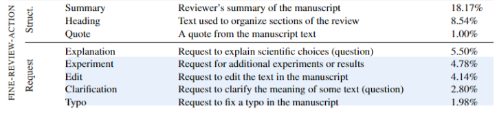

# [Student's Name] Weekly Reports

## Student Information
- **Name**: Zhijingshui
- **Project Title**: Review Overview Generation for papers through Attitude root-Review request Mapping
- **Mentor**: Sukannya Purkayastha
- **Course**: [	Data Analysis Software Project Seminar for Natural Language/6,0]

---

## Reports

### Week 1
- **Update 1**: [papers_summary](paper_summary/papers_summary.md)
- **Update 2**: fill out IP form
- **Update 3**: check how to get reviews for ICLR 2024 OpenReview. 
  - https://docs.openreview.net/how-to-guides/data-retrieval-and-modification/how-to-export-all-reviews-into-a-csv
  - https://docs.openreview.net/how-to-guides/data-retrieval-and-modification/how-to-get-all-reviews#venues-using-api-v2
- **Challenges**:
  ### questions about tasks
  
  > Identify **important concerns** from multiple reviews via Attitude Root Taxonomy [[1](https://aclanthology.org/2023.emnlp-main.894.pdf)]
  > 
  > 1. Finetuning classifiers on the JitsuPEER Dataset and transfer to our scenario.
  - so only attitute root? no attitute themes? if so we should use DISAPERE? JitsuPEER Just used attitute root labels from DISAPERE
      
      ```
      ├── Arg_other
      ├── Asp_clarity
      ├── Asp_meaningful-comparison
      ├── Asp_motivation-impact
      ├── Asp_originality
      ├── Asp_replicability
      ├── Asp_substance
      ```
      
  - if we need themesm where is the model and code piece for predicting themes? 
  > Link the **concerns to requests** from the reviewers eg., all reviewers want more baselines using Requests from DISAPERE taxonomy [[2](https://arxiv.org/pdf/2110.08520)]
  > 
  > 1. Finetuning classifiers on the DISAPERE dataset and inference on the identified concerns.
  - same model? For the six classification tasks, we use bert-base (Devlin et al., 2019) to pro-duce sentence embeddings for each sentence, then classify the representation of the [CLS] token using a feedforward network.
  - what we need to do? collect data from ICLR 2021? annotate some of them? finetune model and use the model to annotate the rest of datasets?
  or use the model from paper, predict for all the data and check if it’s correct
  - what kind of request labels do we have, like following?
      
- **Next Steps**: 
  - create scrum boards
  - collect reviews using OpenReview API
  - experiment with building website

### Week [2]

- **Update 1**: try to run review-to-description model in slurm
- **Update 2**: check backend possibilities (FastAPI, Streamlit and Docker)
- **Update 3**: 
- **Challenges**: libs install for jitsupeer repo not successful, it causes error even with requirements.txt
- **Next Steps**: try to run through review-to-description model

### Week [3]

- **Update 1**: review-to-description model runs successfully on slurm server with rouge score
- **Update 2**: experiment attitute theme classifier
- **Update 3**: 
- **Challenges**: 
- **Next Steps**: finish attitute theme classifier; start to connect model to frontend

### Week [4]

- **Update 1**: connect attitude roots to frontend with fastapi
- **Update 2**: build up attitute theme classifier
- **Update 3**: evaluation review-to-description model with embedding similarity and edit similarity
- **Challenges**: decide which infrastructure to use: 1. frontend backend mix up style; 2. connect model with api call
- **Next Steps**: improve attitute theme classifier; connect attitue theme to frontend

### Week [5]

- **Update 1**: restructure backend, connection between attitude themes and frontend, debug
- **Update 2**: check data leakage of attitude themes classifier, analyse dataset and results of attitude themes classifier
- **Update 3**: slurm script writing for more efficient attitute theme classifier training
- **Challenges**: train-test-val data split for multilabel scenario
- **Next Steps**: connect components to run website; merge branches

### Week [6]

- **Update 1**: components are connected: frontend, backend(segmentation and preprocess), attitude classifier, request classifier
- **Update 2**: prepare for presentation
- **Update 3**: 
- **Challenges**: orchestrating components together is time consuming.
- **Next Steps**: use docker to automate building process; further investigate attitude themes classifier

### Week [7]

- **Update 1**: winter break
- **Update 2**: 
- **Update 3**: 
- **Challenges**: 
- **Next Steps**: 

### Week [8]

- **Update 1**: winter break
- **Update 2**: 
- **Update 3**: 
- **Challenges**: 
- **Next Steps**:
  
### Week [9]

- **Update 1**: sent vm usage requirements for applying vm
- **Update 2**: build docker for frontend and backend
- **Update 3**: 
- **Challenges**: 
- **Next Steps**: further investigate attitude themes classifier, further docker scripts for model components

### Week [10]

- **Update 1**: try out different models for attitude themes; automate pipeline in slurm: send training with diff models at same time, evaluate results and save
- **Update 2**: build docker for frontend and backend
- **Update 3**: 
- **Challenges**: description mapping method leads to none for some classes, need to switch to description generation
- **Next Steps**: further docker scripts for model components; description generation

### Week [11]

- **Update 1**: assist overview generation by providing input data
- **Update 2**: build docker for attitude classifier; set up docker compose file, docker network 
- **Update 3**: 
- **Challenges**: 
- **Next Steps**: description generation; docker scripts for request classifier and summary generation

### Week [12]

- **Update 1**: collect hardware statistics information, confirm requests for applying vm
- **Update 2**: bug fixing due to changes in models, model inference and loading method
- **Update 3**: 
- **Challenges**: due to changes in models, model inference and loading method, some components failed, it's blockage for docker building
- **Next Steps**: description generation, docker scripts for request classifier and summary generation

### Week [13]

- **Update 1**: docker scripts for request classifier and summary generation are finished, docker automation process is almost finished
- **Update 2**: update poster
- **Update 3**: try to connect to vm, but there is connection issue
- **Challenges**: running summary generation with llama in pc is time consuming, can't properly debug, since vm is not accessible yet.
- **Next Steps**: description generation; deploy web server in vm if it's available

### Week [14]

- **Update 1**: web is deployed and is available with url inside HRZ network
- **Update 2**: update documentation about how to use repo in docker/deploy mode or developer mode
- **Update 3**: 
- **Challenges**: 1. have access to vm; 2. current deployment using LLaMA without optimized inference frameworks (like vLLM or Ollama) was a big issue, because it loads and reloads model into gpu upon request, then I changed so that it loads when service starts and never reload. current deployment using LLaMA without optimized inference frameworks (like vLLM or Ollama) can still lead to inefficient resource usage and higher latency; 3. vm doesn't have avx/avx2, however tensorflow, tf-keras needs them, so docker container always exits with 132, it took quite some time to find out what was the error cause.
- **Next Steps**: description generation; paper
---
